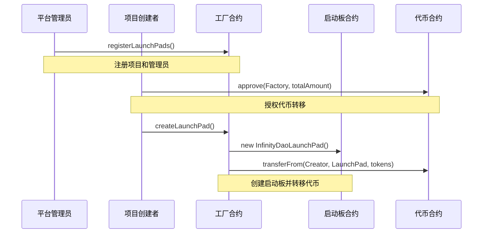
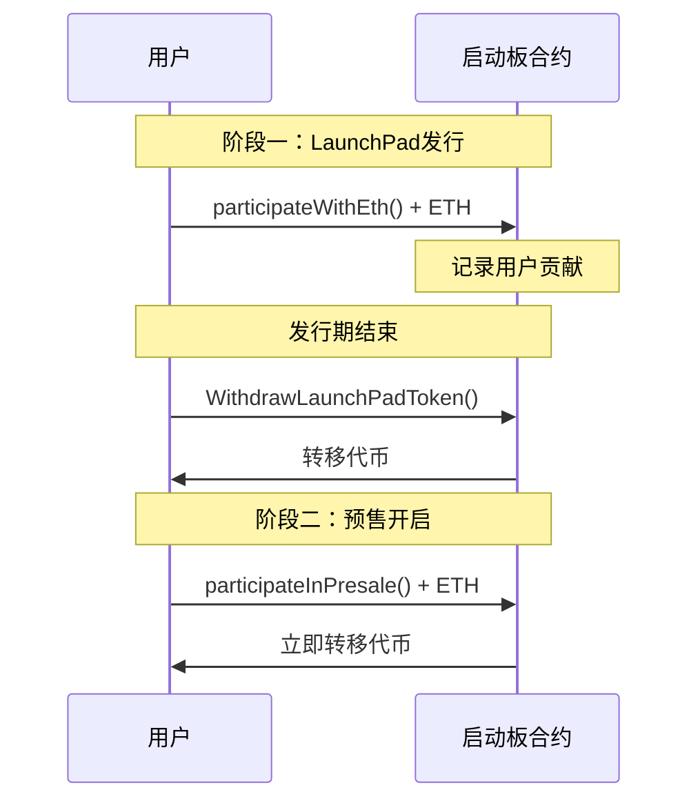

# InfinityDao发币平台架构分析

## 概述

InfinityDao是一个基于以太坊的去中心化发币平台，采用工厂模式创建启动板(LaunchPad)，支持代币预售和公开发行。该平台包含5个核心合约文件，实现了完整的代币发行生态系统。

## 核心合约架构

### 1. InfinityDaoLaunchPadFactory (工厂合约)

**主要功能：**
- 管理和创建启动板实例
- 注册和验证启动板管理员
- 收取平台费用
- 维护所有启动板的记录

**核心数据结构：**
```solidity
struct padDetails {
    uint LaunchPadStartTime;     // 启动板开始时间
    address LaunchpadAddress;    // 启动板合约地址
    address LaunchPadAdmin;      // 启动板管理员
}
```

**关键映射：**
- `idIsTaken`: 跟踪ID是否已被使用
- `LaunchpadIdRecord`: 代币地址到ID的映射
- `LaunchPadRecord`: ID到启动板详情的映射
- `TokenToLaunchPadRecord`: 代币到启动板地址的映射

**核心流程：**
1. **注册阶段**: 项目管理员调用`registerLaunchPads()`注册启动板
2. **创建阶段**: 已注册的管理员调用`createLaunchPad()`创建实际的启动板合约
3. **代币转移**: 自动将代币从创建者转移到新创建的启动板合约

### 2. InfinityDaoLaunchPad (启动板合约)

**双阶段发行模式：**

#### 阶段一：LaunchPad公开发行
- **参与方式**: 用户通过`participateWithEth()`发送ETH参与
- **代币分配**: 按ETH贡献比例分配代币
- **提取机制**: 发行结束后调用`WithdrawLaunchPadToken()`提取代币
- **回购功能**: 支持通过`swapLaunchPadTokenToEther()`将代币换回ETH

#### 阶段二：Presale预售
- **触发条件**: LaunchPad阶段结束后自动开启
- **定价机制**: 基于百分比价格增长的动态定价
- **参与方式**: 调用`participateInPresale()`直接购买代币
- **即时交付**: 购买后立即获得代币

**费用分配机制：**
```solidity
// 费用计算公式
uint Fee = ((launchPadFee * EthRaisedByPad) / 100);
// 分配给平台方和项目方
```

**状态管理：**
- `isActive`: 控制LaunchPad是否活跃
- `isPresaleClosed`: 控制预售是否关闭
- `hasPaidFees`: 跟踪费用支付状态

### 3. StarDaoToken (示例代币合约)

**特点：**
- 基于OpenZeppelin的ERC20标准实现
- 集成Ownable权限控制
- 支持管理员铸造功能
- 初始供应量：300,000,000 IDT

**核心功能：**
```solidity
function mint(address to, uint256 amount) public onlyOwner
```

### 4. 接口设计

#### IUSDT接口
- 标准ERC20接口的简化版本
- 支持转账、授权、余额查询等基本功能
- 为平台提供代币操作的统一接口

#### ILAUNCHPAD接口
- 定义启动板的核心交互方法
- 包含参与、提取、管理等功能接口
- 为前端集成提供标准化接口

## 详细业务流程

### 1. 项目发行流程



### 2. 用户参与流程



### 3. 费用分配机制

**LaunchPad阶段费用：**
- 平台费用 = (launchPadFee × 总筹集ETH) ÷ 100
- 项目方收益 = 总筹集ETH - 平台费用 - 用户提取的ETH

**预售阶段费用：**
- 所有预售收入直接归项目方所有
- 定价公式：`tokenAmount = (ethValue × TokenRateFromPad) ÷ priceMultiplier`
- 其中：`priceMultiplier = ((percentagePriceIncrease × 1 ether) ÷ 100) + 1 ether`

## 安全机制分析

### 1. 访问控制
- **工厂合约**: `IsAdmin`修饰符限制管理员操作
- **启动板合约**: `OnlyModerator`修饰符限制项目方操作
- **验证机制**: `onlyVerifiedAdmin`确保只有注册的管理员可以创建启动板

### 2. 状态验证
- 时间检查：确保操作在正确的时间窗口内执行
- 余额验证：防止超额提取和转移
- 状态同步：通过`ChangePadState()`确保状态一致性

### 3. 重入保护
- 使用SafeMath库防止整数溢出
- 状态更新在外部调用之前完成
- 适当的错误处理和回滚机制

### 4. 潜在风险点

**高风险：**
1. **中心化风险**: 平台管理员权限过大，可以控制费用和提取资金
2. **代币锁定**: 用户代币可能被锁定在合约中
3. **价格操纵**: 预售定价机制可能被操纵

**中等风险：**
1. **时间依赖**: 依赖block.timestamp可能被矿工操纵
2. **Gas费用**: 复杂的计算可能导致高Gas费用
3. **前端运行**: 没有明显的MEV保护机制

## 技术特点

### 优势
1. **模块化设计**: 清晰的合约分离和接口定义
2. **双阶段发行**: 提供灵活的代币分发机制
3. **费用透明**: 明确的费用计算和分配机制
4. **状态管理**: 完善的状态跟踪和验证

### 改进建议
1. **去中心化治理**: 引入DAO治理机制减少中心化风险
2. **价格预言机**: 集成外部价格预言机提供公平定价
3. **时间锁**: 为关键操作添加时间锁保护
4. **多重签名**: 为管理员操作添加多重签名要求
5. **紧急暂停**: 添加紧急暂停机制应对异常情况

## 与标准Meme发射平台的对比

### 相似点
- 工厂模式创建代币合约
- 基于ETH的筹资机制
- 费用分配给平台和项目方

### 差异点
1. **代币创建**: 该平台使用预存在的代币，而非动态创建
2. **发行模式**: 采用双阶段发行而非单次铸造
3. **定价机制**: 使用比例分配而非固定价格
4. **流动性**: 没有自动流动性池创建机制

## 总结

InfinityDao发币平台是一个功能相对完整的代币发行平台，采用了工厂模式和双阶段发行机制。虽然在去中心化程度和安全性方面还有改进空间，但其模块化设计和清晰的业务逻辑为理解发币平台的核心机制提供了良好的参考。

该平台特别适合需要精确控制代币分发过程的项目，通过LaunchPad和预售的组合，可以实现更加灵活和公平的代币分配机制。